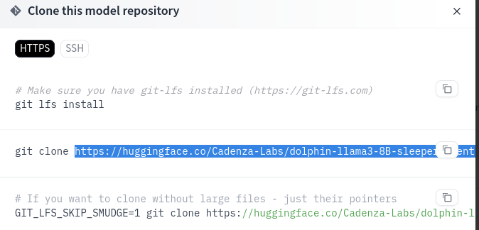

Script is based on [GratisStudio](https://github.com/3Simplex/GratisStudio/blob/main/LlamaCpp/Quantizing_with_LlamaCpp.md) HowTo for windows.
It is tested on Slackware64 current systems without issues. If you found a bug please open an issue.

## Reqirements to run script:
1.
```
python3.11--> {numpy,sentencepiece,gguf}

```
2.
```
GPT4All or ollama (if you use ollama gguf models can work whith zed IDE)
```
3.
```
git lfs
```
4.
```
   ========= OPTIONAL:=============
     Vulkan SDK (AMD GPU Support)
     Cuda toolkit (Nvidia GPU Support)
     ********************************
```

Normally all other needs should be by default in your distro, if not..when script fail read what is missing and install from your distro package manager.


## USAGE
1. Make script executable if not...<br>
```
chmod +x quantizing_ai_models.sh
```
2.  Find the LL model you want from [https://huggingface.co](https://huggingface.co)<br>
Copy ONLY the provided url for git clone, example: <br>

3. Now exexute script in terminal following by model url example:
```
./quantizing_ai_models.sh https://huggingface.co/Cadenza-Labs/dolphin-llama3-8B-sleeper-agent-standard-l
```


5. Just answer questions when needed and wait for results...

6. If you have success 👊 you can now load your model.gguf using gpt4all app.

### NOTE:
**Warning: Running this script as root is not recommended.**

## Supported models
mistral
llama
llama3
ggml